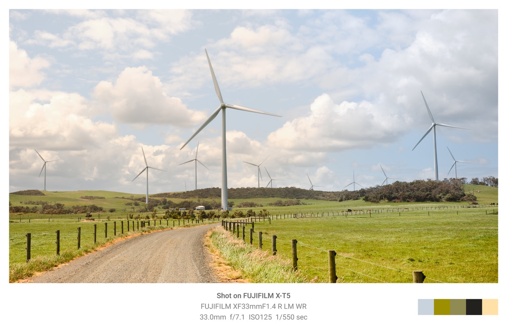
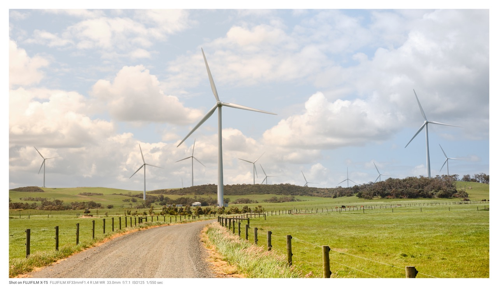
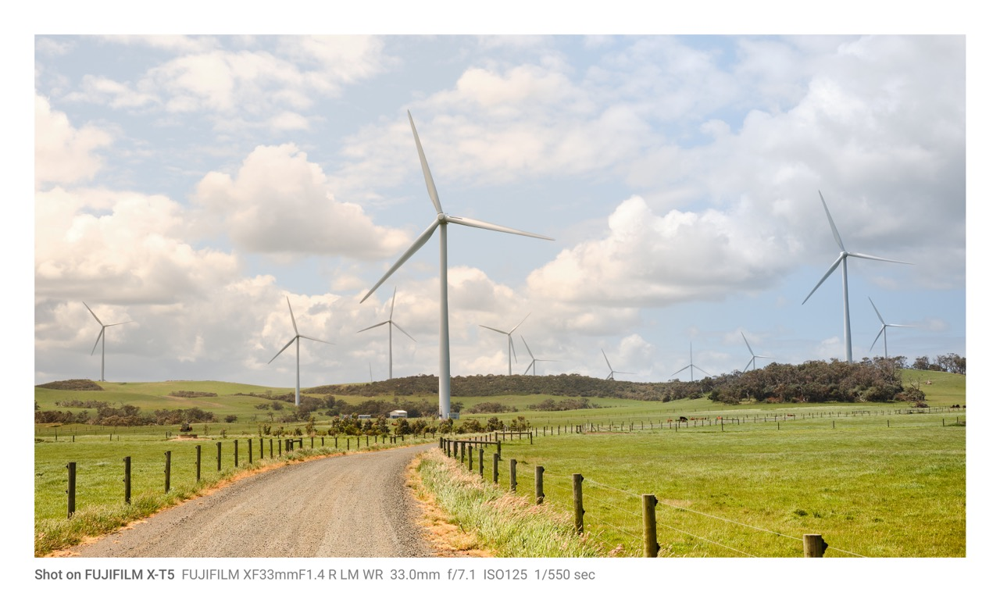
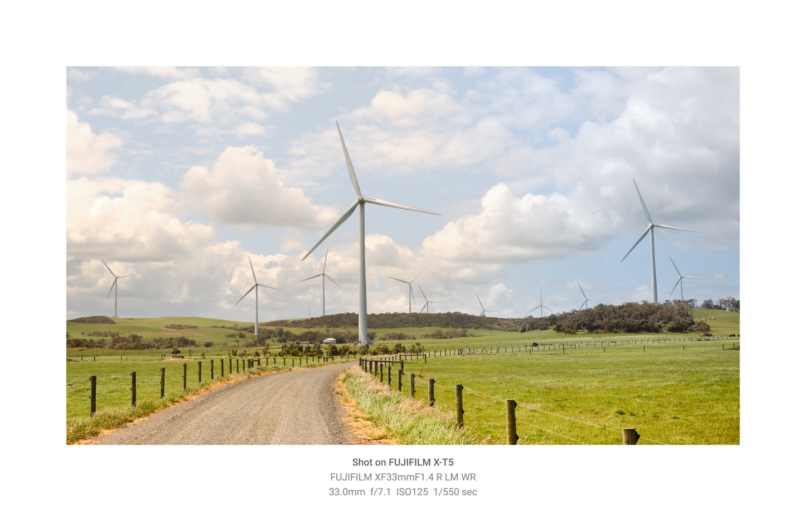
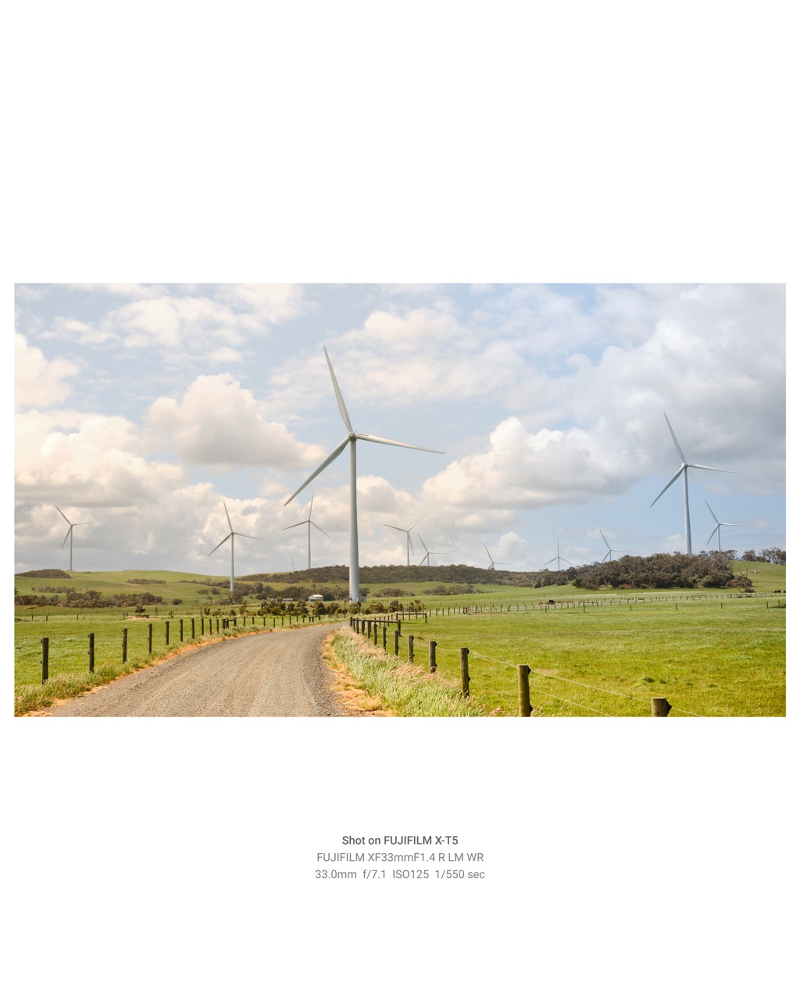

# Photo Border Thing

A small script to add a border to a jpeg or png photo.

Exif data can also be extracted and added to the border if the mood strikes.

A colour palette can be added to the border as well.

## Installation

```bash
git clone https://github.com/stevequinn/photoborder
```

```bash
cd photoborder
```

```bash
pip install -r requirements.txt
```

## Usage

```bash
usage: python main.py [-h] [-e] [-p] [-f] [-fb] [-t{s,m,l,p,i}] filename

Add a border and exif data to a jpg or png photo

positional arguments:
  filename

options:
  -h, --help              Show this help message and exit
  -e, --exif              Print photo exif data on the border
  -p, --palette           Add colour palette to the photo border
  -t, --border_type       Border Type: p for polaroid, s for small, m for medium, l for large, i for instagram (default: s)
  -f, --font              Font Typeface to use (default: Roboto-Regular.ttf)
  -fv, --fontvariant      Font style variant to use (default: 0)
  -fb, --fontbold         Bold Font Typeface to use (default: Roboto-Medium.ttf)
  -fbv, --fontboldvariant Bold Font style variant to use (default: 0)
  --include               File patterns to include (default: *.jpg *.jpeg *.png, *.JPG, *.JPEG, *.PNG)
  --exclude               File patterns to exclude (default: *_border*)

Made for fun and to solve a little problem.
```

---

> Note: This is a hacked together little script. Use at your own peril...

## osx_services

Adds quick actions to you OSX menu for quick deployment of tool.

## Fonts

The repo comes with [Roboto](https://fonts.google.com/specimen/Roboto) (Regular, Medium & Bold).

```photoborder/fonts```

Should you wish to use another font you should add it to the ```fonts``` directory and use the appropriate arguments

## Testing

There are some very simple tests available in the `tests/` directory.

You can run these with:

```bash
pytest -s ./tests
```

For specific test modules just do the same for the file like so:

```bash
pytest -s ./tests/test_text.py
```

## Examples


*`> python main.py -t p -e -p image.jpeg`*


*`> python main.py -t s -e image.jpeg`*


*`> python main.py -t m -e image.jpeg`*


*`> python main.py -t l -e image.jpeg`*


*`> python main.py -t i -e image.jpeg`*
